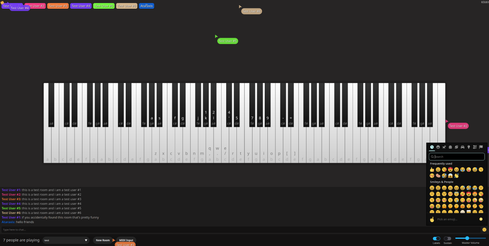
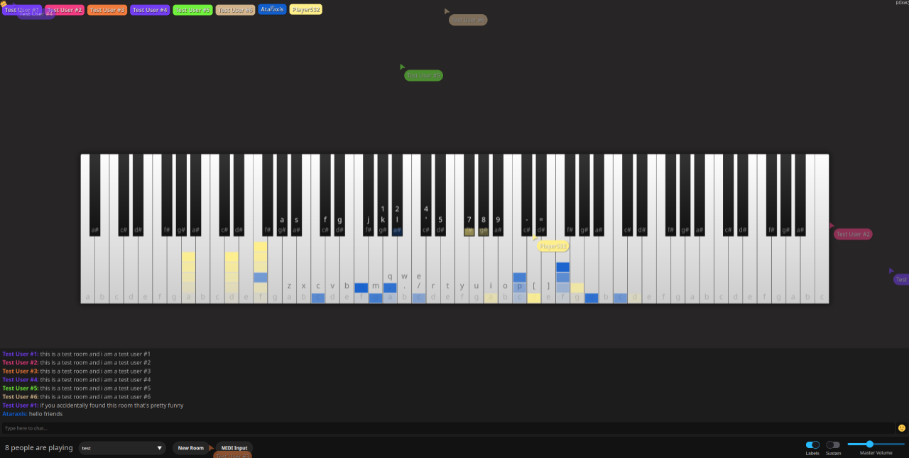

# ACpiano

**ACpiano** is a real-time multiplayer web piano where you can play and chat with people all around the world. ACpiano lets multiple users play and hear piano notes in real time, with low latency and synchronized visuals.

You can try ACpiano live at [ataraxis.codes/piano](https://ataraxis.codes/piano/)

## Features

- 🎹 **Real-time Piano** - Play notes instantly with others in shared virtual rooms.
- 💬 **In-Game Chat** - Chat with others in the room, with emojis, URL auto-highlighting, and optional chat filtering.
- 🔌 **MIDI Input Support** - Connect a physical MIDI device and play with dynamic note velocity.
- 🖱️ **Cursor Tracking** - See other players' cursors as they move around the room.
- 💻 **PC Keyboard Support** - Use your PC keyboard to play, no piano required.
- 🚀 **Blazing-fast WebSocket Protocol** - Smooth, low-latency connections for real-time collaboration.

## Screenshots




## Tech Stack

### Client

- **Core:**

  - Vanilla JavaScript
  - Vite

- **Rendering & Audio:**

  - Canvas API
  - Web Audio API

- **Performance & Storage:**

  - Web Workers
  - IndexedDB

- **UI & UX:**
  - Shoelace.js
  - SweetAlert2
  - Twemoji
  - Emoji Mart

### Server

- **Runtime:**

  - Bun.js

- **Communication:**

  - WebSockets

- **Database:**

  - SQLite3

- **Security:**
  - `node:crypto`

## Run Locally

**Requirements:**

- Bun
- Node.js
- pnpm

**Setup:**

- Clone the repository:

```bash
git clone https://github.com/atar4xis/acpiano
cd acpiano
```

**Server:**

- Install dependencies:

```bash
cd server
bun install
```

- Copy the default environment config:

```bash
cp .env.default .env
```

- Edit `.env` to configure environment variables:

```bash
# use long, unpredictable values and keep them secret
SALT_ONE="first_long_random_string"
SALT_TWO="second_long_random_string"

# optional: set a secret phrase that grants admin access when sent in chat
# note: must be longer than 64 characters
ADMIN_PHRASE=""

# add your frontend dev and prod origins
ALLOWED_ORIGINS="comma,separated,values"
```

⚠️ Never share or commit your `.env` files. Always keep them private in production.

- Start the server:

```bash
# in development mode
bun run dev

# or in production
bun run start
```

- The server will start on the `PORT` specified in your `.env` file.

**Client:**

- Install dependencies:

```bash
cd client
pnpm install
```

- Copy the default environment config:

```bash
cp .env.default .env
```

- Set the WebSocket backend URL in `.env`:

```bash
VITE_WEBSOCKET_URL="ws://localhost:8080"
```

- Start the development server:

```bash
pnpm run dev
```

- Or build for production (output will be in the `dist/` folder):

```bash
pnpm run build
```

## Environment Variables

### Server

| Variable          | Description                                                                           | Default                                           |
| ----------------- | ------------------------------------------------------------------------------------- | ------------------------------------------------- |
| `PORT`            | The port number the server listens on.                                                | `8080`                                            |
| `DB_PATH`         | File path or name of the SQLite database file.                                        | `"piano.db"`                                      |
| `SALT_ONE`        | First secret salt used for internal hashing. Should be long and unpredictable.        | `""`                                              |
| `SALT_TWO`        | Second secret salt.                                                                   | `""`                                              |
| `TEST_COOKIE`     | Cookie name used for simulating IPs in testing.                                       | `""` (disabled by default)                        |
| `ADMIN_PHRASE`    | Secret phrase that grants admin status when sent in chat. Must be over 64 characters. | `""` (disabled by default)                        |
| `ALLOWED_ORIGINS` | Comma-separated list of allowed origins for WebSocket connections.                    | `"http://localhost:$PORT,http://127.0.0.1:$PORT"` |

### Client

| Variable             | Description                               | Default                  |
| -------------------- | ----------------------------------------- | ------------------------ |
| `VITE_WEBSOCKET_URL` | The WebSocket URL the client connects to. | `"ws://localhost:8080/"` |

## Contributing

Contributions are welcome!

Please see [CONTRIBUTING.md](CONTRIBUTING.md) for guidelines and setup instructions.

## License

ACpiano is licensed under the GNU General Public License v3.0. See the [LICENSE](LICENSE) file for details.
